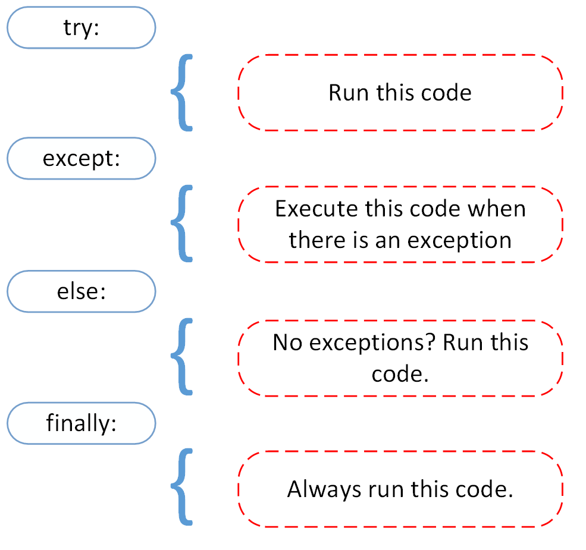

# Day11 - Exception
[<< Day 10](../Day10/Day10.md)  |  [Day 12 >>](../Day12/Day12.md)

### Agenda
- [Exception](#higher-order-functions)
  - [Built-in Exception Handling](#built-in-exception-handling)
  - [Custom Exception](#custom-exception)

## Exception

When errors occur, Python raises an exception, prints the error message in the terminal, and halts the program. However, programmers typically don't want the program to crash when an error occurs.

To handle errors gracefully, Python provides exception handling methods, which include four keywords: `try`, `except`, `else`, and `finally`.



### Built-in Exception Handling

```python
try:
    name = input('Key in your name:')
    height = input('Key in your height in meter:')
    weight = input('Key in your weight in kilogram:')
    bmi = int(weight) / int(height) ** 2
    print(f'Hi {name}! Your BMI is {bmi}')
except Exception as e:
    # If programmers donot specify any error types, the except block will catch all errors. 
    # However, this practice is not recommended because it may catch potential errors that programmers are not aware of, which can increase the difficulty of debugging.
    print(f'Error happens! Error: {e}')
```

To handle errors in a more specific manner, programmers can specify the error type in the `except` block.

```python
try:
    name = input('Key in your name:')
    height = input('Key in your height in meter:')
    weight = input('Key in your weight in kilogram:')
    bmi = int(weight) / int(height) ** 2
    print(f'Hi {name}! Your BMI is {bmi}')
except (TypeError, ValueError) as e:
    print(f'Wrong input message! Error:{e}')
```

Or programmers can specify multiple error types in the several `except` block.

```python
try:
    name = input('Key in your name:')
    height = input('Key in your height in meter:')
    weight = input('Key in your weight in kilogram:')
    bmi = int(weight) / int(height) ** 2
    print(f'Hi {name}! Your BMI is {bmi}')
except TypeError as e:
    print(f'TypeError occurrs! Error:{e}')
except ValueError as e:
    print(f'ValueError occurrs! Error:{e}')

```

Exception handling with `else` and `finally`.

```python
try:
    name = input('Key in your name:')
    height = input('Key in your height in meter:')
    weight = input('Key in your weight in kilogram:')
    bmi = int(weight) / int(height) ** 2
    print(f'Hi {name}! Your BMI is {bmi}')
except TypeError as e:
    print(f'TypeError occurrs! Error:{e}')
except ValueError as e:
    print(f'ValueError occurrs! Error:{e}')
else:
    print('This code block is only running while there is no exception happens!')
finally:
    print('This code block is always running!')
```

### Custom Exception

To handle specific errors more explicitly, programmers can customize their own exceptions, as the built-in exceptions are general types.

```python
# It is recommended name the error type class with descriptive name, ending with `Error` and avoid using abbreviation.
class InvalidParameterError(Exception):
    def __init__(self, message = 'Height and Weight must be greater than 0'):
        self.message = message
        super().__init__(self.message)
try:
    name = input('Key in your name:')
    height = input('Key in your height in meter:')
    weight = input('Key in your weight in kilogram:')
    if int(height) <= 0 or int(weight) <= 0:
        raise InvalidParameterError(height, weight)
    bmi = int(weight) / int(height) ** 2
    print(f'Hi {name}! Your BMI is {bmi}')
except (TypeError, ValueError, InvalidParameterError) as e:
    print(f'Error occurrs! Error: {e}')
```
