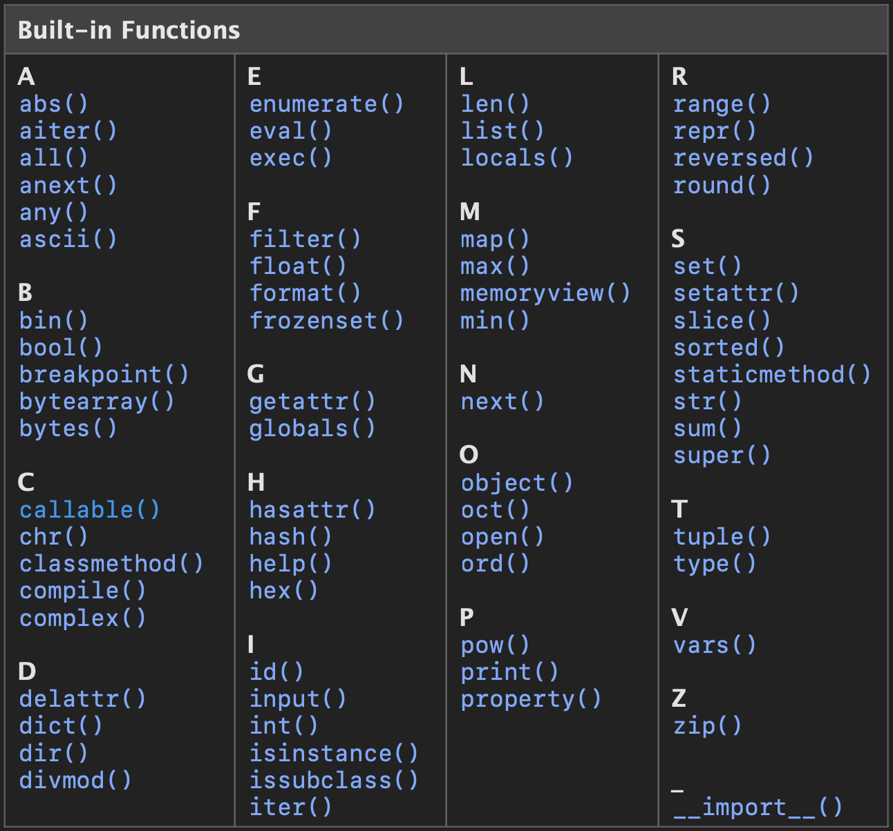

# Day2 - Built-in Functions
[<< Day 1](../Day1/Day1.md)  |  [Day 3 >>](../Day3/Day3.md)
### Agenda
- [Built-in Functions](#built-in-functions)
    - [Demonstrations](#demonstrations)
        - [Begin with A](#begin-with-a)
        - [Begin with B](#begin-with-b)
        - [Begin with C](#begin-with-c)
        - [Begin with D](#begin-with-d)
        - [Begin with E](#begin-with-e)
        - [Begin with F](#begin-with-f)
        - [Begin with G](#begin-with-g)
        - [Begin with H](#begin-with-h)
        - [Begin with I](#begin-with-i)
        - [Begin with L](#begin-with-l)
        - [Begin with M](#begin-with-m)
        - [Begin with N](#begin-with-n)
        - [Begin with O](#begin-with-o)
        - [Begin with P](#begin-with-p)
        - [Begin with R](#begin-with-r)
        - [Begin with S](#begin-with-s)
        - [Begin with T](#begin-with-t)
        - [Begin with V](#begin-with-v)
        - [Begin with Z](#begin-with-z)

## Built-in Functions
The table below shows the built-in functions in Python. Unlike modules, these functions can be used globally without importing or configuring. Different versions of Python may have different built-in functions, here I demonstrate the **Python 3.12.1**, please refer to [Python Documentation](https://docs.python.org/3/library/functions.html#callable) for more information.



### Demonstrations
Demonstration of commonly used built-in functions

#### Begin with A

```python
# abs(x) will return the absolute value of a number.
print(abs(-5)) # 5
print(abs(1.2)) # 1.2
print(abs(1 + 2j)) # magnitude of 1 + 2j, around 2.236

# all(iterable) will return True if all elements in an iterable are True(or if the iterable is empty).
print(all([True, True, True])) # True
print(all([True, True, False])) # False
print(all([])) # True

# any(iterable) will return True if any element in an iterable is True, if the iterable is empty will return False.
print(any([False, False, False])) # False
print(any([True, True, False])) # True
print(any([])) # False
```

#### Begin with B

```python
# bin(x) converts an integer to a binary string prefixed with '0b'
print(bin(10)) # '0b1010'
print(bin(-12)) # '-0b1100'

# bool(x=false) returns the boolean value of an object, based on the Python Truth Value Testing
#   Truth Value Testing
#     The following will return False:
#       constants: None and False
#       zero of any numeric type: 0, 0.0, 0j, Decimal(0), Fraction(0, 1)
#       empty sequences and collections: '', (), [], {}, set(), range(0)
print(bool(0.0)) # False
print(bool(1j)) # True
print(bool([])) # False
print(bool()) # False
print(bool(range(0))) #False

# breakpoint(*args, **kws) drops users into the debugger at the call site. Kind of like gdb in C, program will stop and enter the python debugger.
def fib(num: int = 0):
    breakpoint()
    if num <= 1:
        return num
    return fib(num - 1) + fib(num - 2)
sequence = [fib(i) for i in range(5)]

# bytes(source, encoding, errors) returns a new “bytes” object which is an immutable sequence of integers in the range 0 <= x < 256
print(bytes("Hey", "utf-8")) # b"Hey"
print(bytes(3)) # b"\x00\x00\x00"
```

#### Begin with C
```python
# chr(i) returns a character whose Unicode code point is the integer i.
print(chr(65)) # 'A'
print(chr(8364)) # '€'

# classmethod is a decorator, which transforms a method into a class method.
# Class method is a method that is bound to the class, not the object.
# This means users can call a class method without creating an instance.
class MyClass:
    @classmethod
    def my_method(cls):
        print("This is class method")
    def not_class_method(self):
        print("This is not class method")
MyClass.my_method() # "This is class method"
MyClass.not_class_method() # TypeError
MyClass().not_class_method() # "This is not class method"
```

#### Begin with D

```python
# delattr(object, name) deletes an attribute from an object
class Example:
    x = 5

print(Example.x) # 5
delattr(Example, 'x')
print(Example.x) # AttributeError

# dict(**kwarg)
# dict(mapping, **kwarg)
# dict(iterable, **kwarg)
# It creates a dictionary object
print(dict()) # {}
print(dict(a=1, b=2)) # {'a': 1, 'b': 2}
print(dict([('a', 1), ('b', 2)])) # {'a': 1, 'b': 2}

# dir(object) show the names of valid attributes for that object
class Example:
    def __init__(self):
        self.x = 5
        self.y =6
    i = 7
    j = 8
dir(Example) # list all valid attributes of Example, not include x and y because they won't be created until an instance be created
dir(Example()) # list all valid attributes of Example, including x and y

# divmod(a, b) returns the quotient and remainder of two numbers
print(divmod(10, 3)) # (3, 1)
print(divmod(15, 4)) # (3, 3)
```

#### Begin with E
```python
# enumerate(iterable, start=0) returns an enumerate object, which includes index and value of an iterable onject
letters = ['a', 'b', 'c']
print(list(enumerate(letters))) # [(0, 'a'), (1, 'b'), (2, 'c')]

# eval(expression, globals=None, locals=None) evaluates a Python expression. If provided, globals, must be a dictionary. If provided, locals can be any mapping object.
# globals and locals will use dictionary to replace the a, b, c with corresponding variables
a, b, c = 4, 5, 6
d, e, f = 7, 8, 9
eval("print('a + b + c)", {"a":a, "b":b, "c":c}) # 15
eval("print(a + b + c)", {"a":a, "b":b, "c":c}, {"a":d, "b":e, "c":f}) # 24
```

#### Begin with F
```python
# filter(function, iterable) filters elements of an iterable based on a function. And return a filter object.
def is_even(n):
    return n % 2 == 0
print(list(filter(is_even, [1, 2, 3, 4, 5, 6, 7, 8, 9, 10]))) # [2, 4, 6, 8, 10]

# float(x) converts an integer or a string to a floating point number.
print(float(10)) # 10.0
print(float("   +3.53\n")) # 3.53
print(float("+1E5")) # 100000.0

# format() usually used to format a string
# After python3.6, usage of f-string is recommended
print("Name: {name}".format(name="John"))
print("{:.2f}".format(3.1415926))
```

#### Begin with G
```python
# getattr() returns the value of the named attribute of object
class Example:
    def __init__(self):
        self.y = 7
    x = 5
print(getattr(Example, 'x')) # 5
# y will be created after the instance of Example be created
print(getattr(Example(), 'y')) # 7

# globals() returns the dictionary implementing the current module namespace
print(globals())
```

#### Begin with H
```python
# hasattr() returns True if an object has the specified attribute
class Example:
    def __init__(self):
        self.y = 7
    x = 5

print(hasattr(Example, 'x')) # True
# y will be created after the instance of Example be created
print(hasattr(Example, 'y')) # False

# hex(s) converts an integer number to a lowercase hexadecimal string prefixed with “0x”.
print(hex(243)) # 0xf3
print(hex(-56)) # -0x38
```

#### Begin with I
```python
# id() returns the identity of an object
x = 5
print(id(x)) # a unique ID for the x

# input() reads a line from input
name = input("Enter your name: ")
print("Hello,", name)

# int(x) returns an integer object constructed from a number or string x, or return 0 if no arguments are given
print(int("25")) # 25
print(int()) # 0

# isinstance(object, classinfo) returns True if the object argument is an instance of the classinfo argument.
print(isinstance("Hey", str)) # True

# issubclass(class, classinfo) returns True if class is a subclass (direct, indirect, or virtual) of classinfo.
class cls_A:
  def __init__(self, name):
    print(f"It's Class {name}")

class cls_B(cls_A):
  def __init__(self):
    cls_A.__init__('B')
    
print(issubclass(cls_B, cls_A)) # True 
print(issubclass(cls_B, list)) # False
print(issubclass(cls_B, (list, cls_A))) # True
print(issubclass(cls_A, (list, cls_A))) # True
```

#### Begin with L
```python
# len() returns the length of an object
print(len([1, 2, 3, 4, 5])) # 5
print(len("Hello")) # 5

# list() returns a list if input is iterable object
print(list((1, 2, 3))) # [1, 2, 3]
print(list("Hello")) # ['H', 'e', 'l', 'l', 'o']

# locals() updates and return a dictionary representing the current local symbol table.
print(locals())
```

#### Begin with M
```python
# map(function, iterable, *iterables) returns an map object that applies function to every item of iterable, yielding the results.
def square(x):
    return x * x

nums = [1, 2, 3, 4]
squared = map(square, nums)
print(list(squared)) # [1, 4, 9, 16]

# max(iterable, *, default, key=None) returns the largest item in an iterable or the largest of two or more arguments. Key means key function, max() will based on the result from the key function to find the maximum value.
# min(iterable, *, default, key=None) is the same as the max(), but it returns the smallest item.
def keyfunc(x):
    return x * x
print(max([], default = 5)) # 5
print(max([-9, 5, 6, 8], key= keyfunc)) # 9
```

#### Begin with O
```python
# oct() converts an integer to an octal string prefixed with “0o”.
print(oct(10)) # '0o12'
print(oct(20)) # '0o24'

# open(file, mode='r', buffering=- 1, encoding=None, errors=None, newline=None, closefd=True, opener=None) opens file and return a corresponding file object.
# Refer to https://docs.python.org/3/tutorial/inputoutput.html#tut-files

# ord(c) returns an integer representing the Unicode code point of that character
print(ord("a")) # 97
```

#### Begin with P
```python
# pow(base, exp, mod=None) returns base to the power exp, mod means the modulo
print(pow(2, 3)) # 8
print(pow(2, 3, 5)) # 3 (equivalent to (2 ** 3) % 5)

# print(*objects, sep=' ', end='\n', file=None, flush=False) prints objects to the text stream file, separated by sep and followed by end. sep, end, file, and flush, if present, must be given as keyword arguments.
# file means output to which file, flush means whether it would refresh the file
print("Hello", "world!") # Hello world!
print("Hello", "world!", sep="") # Helloworld!
print("Hello", "world!", end="") # Next stdout will show in the same line

# property() returns a property attribute. Usually used to be a decorator and create a attribute setter, getter, deletter in an object.
# property() can customize the behavior of setting a attribute, it can also protect an attribute from accidentally modified.
class Example:
    def __init__(self):
        self._dem = 1
    
    @property
    def dem(self):
        # attribute getter
        return self._dem

    @dem.setter
    def dem(self, value):
        self._dem += value

obj = Example()
print(obj.dem) # 1
obj.dem = 5
print(obj.dem) # 6
del obj.dem # AttributeError: can't delete attribute
```

#### Begin with R
```python
# range(start, stop, step=1) returns an immutable sequence type
print(list(range(1, 10, 2))) # [1, 3, 5, 7, 9]

# repr(object) returns a string containing a printable representation of an object
example_str = "Hey\t it's an example containing tab"
print(example_str) # Hey	 it's an example containing tab
print(repr(example_str)) # 'Hey\t it\'s an example containing tab'

# reversed(seq) returns a reverse iterator
nums = [1, 2, 3, 4, 5]
print(list(reversed(nums))) # [5, 4, 3, 2, 1]

# round(number, ndigits=None) returns number rounded to ndigits precision after the decimal point
# iif two multiples are equally close, rounding is done toward the even choice 
print(round(3.5)) # 4
print(round(3.14159, 2)) # 3.14
```

#### Begin with S
```python
# set(iterable) returns a new set object
numbers = [1, 2, 2, 3, 4, 5, 5]
print(set(numbers)) # {1, 2, 3, 4, 5}

# setattr(object, name, value) sets the value of an attribute of an object
class Example:
    pass

setattr(Example, 'x', 5)
print(Example.x) # 5

# sorted(iterable, /, *, key=None, reverse=False) returns a new sorted list from the items in iterable.
def key_func(x):
    return x * x
nums = [-9, 5, -6, 3, 7]
sorted_nums = sorted(nums, key=key_func, reverse=True)
print(sorted_nums) # [-9, 7, -6, 5, 3]

# staticmethod() is a decorator, which transforms a method into a static method.
# It's similar to the @classmethod decorator, but it's not bonding with the class. Therefore, a staticmethod can only deal with the input parameter of the method and can not call the attribute of the class.
class MyClass:
    z = 10
    @staticmethod
    def static_method(x, y):
        return x * y
    @classmethod
    # cls points to the class MyClass
    def cls_method(cls, x, y):
        return x * y * cls.z

print(MyClass.static_method(5, 6)) # 30
print(MyClass.cls_method(5, 6)) # 300

# str(object) returns a string version of object
example = 123
print(type(example)) # int
print(type(str(example))) # str

# sum(iterable, /, start=0) returns the sum of elements in an iterable and start
numbers = [1, 2, 3, 4, 5]
print(sum(numbers, start = 9)) # 24

# super(type, object_or_type=None) returns a proxy object that delegates method calls to a parent class
class Base_cls:
    def __init__(self):
        print("It's init function in Base_cls")

class Child_cls(Base_cls):
    def __init__(self):
        super().__init__()

Child_cls() # Output: It's init function in Base_cls
```

#### Begin with T
```python
# tuple(iterable) returns an immutable sequence type which is called tuple
print(tuple("Hello")) # ('H', 'e', 'l', 'l', 'o')

# type() will return the type of an object
print(type(5)) # <class 'int'>
```

#### Begin with V
```python
# vars(object) returns the __dict__ attribute for an bject with a __dict__ attribute, but not include implict attributes such as __init__.
class Example:
    def __init__(self):
        self.x = 5
        self.y = 10
obj = Example()
print(vars(obj)) # {'x': 5, 'y': 10}
# if not __dict__ attribute, vars() will return {}
del obj.__dict__
print(vars(obj)) # {}
```

#### Begin with Z
```python
# zip(*iterables, strict=False) iterates over several iterables in parallel, producing tuples with an item from each one.
nums = [1, 2, 3]
letters = ['a', 'b', 'c']
zipped = zip(nums, letters)
print(list(zipped)) # [(1, 'a'), (2, 'b'), (3, 'c')]
```

